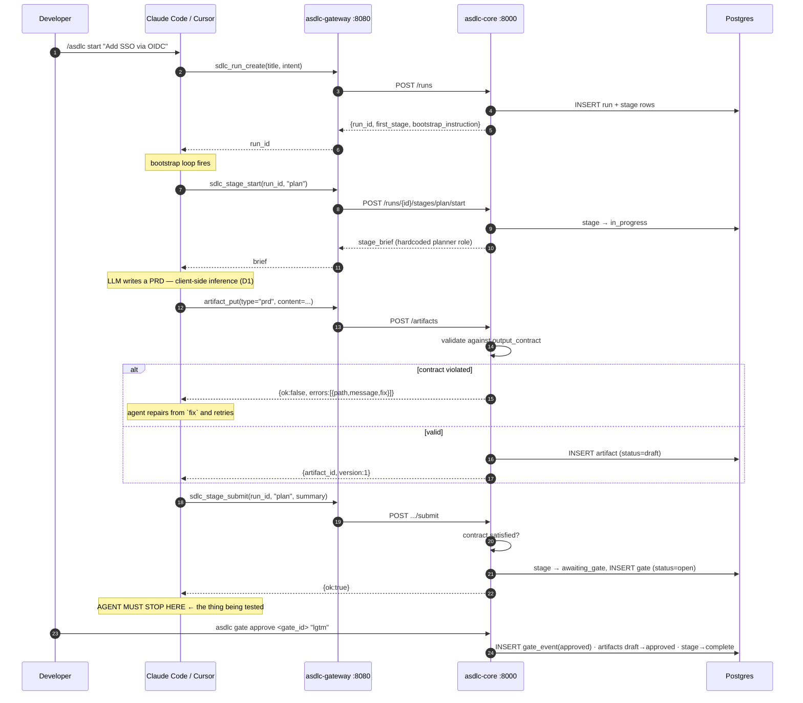

# M0 — Walking Skeleton

**Weeks 1–2** · [← Master plan](MILESTONES.md) · Implements [`docs/12-roadmap.md` Phase 0](../docs/12-roadmap.md)

> **Goal:** one stage, one tool, one gate, end to end. Prove the mechanism.
>
> **The question this milestone answers:** do client-side agents reliably fetch and obey a
> server-served brief? If the answer is "only in Claude Code," the design needs rework **now**,
> not in month three.

Everything here is disposable except the database schema and the tool signatures. Build it to be
thrown away; build the schema to be kept.

---

## Scope

| In | Out (deliberately) |
|---|---|
| Postgres only — artifacts as `TEXT` columns | MinIO, Qdrant, Redis, TEI, LiteLLM |
| One hardcoded `planner` role, one hardcoded brief | Prompt registry, role YAML, 6 roles |
| 5 MCP tools | The other 18 |
| CLI gate approval | Approvals UI, PR channel, Slack |
| `ASDLC_AUTH_MODE=none` | token / OIDC auth |
| Manual `.mcp.json` in one repo | `asdlc init`, packs, marketplace |
| Contract validation (type + count) | Schema validation, provenance, versioning, attestations |

**Why the schema is not disposable:** `project_id` on every table (invariant **I1**) and an
append-only `gate_events` (invariant **I4**) are both far more expensive to retrofit than to build.
Everything else in M0 can be rewritten in M1 without cost.

---

## Sub-milestones

| ID | Name | Depends on | Days |
|---|---|---|---|
| [M0.1](#m01--repo-scaffold-tooling-and-compose-baseline) | Repo scaffold, tooling & compose baseline | — | 1.5 |
| [M0.2](#m02--core-domain-model-and-migrations) | Core domain model & migrations | M0.1 | 2 |
| [M0.3](#m03--stage-brief-builder-v0) | Stage brief builder v0 | M0.2 | 1.5 |
| [M0.4](#m04--mcp-gateway-with-five-tools) | MCP gateway with five tools | M0.2, M0.3 | 2.5 |
| [M0.5](#m05--gate-engine-v0-and-cli-approval) | Gate engine v0 & CLI approval | M0.2 | 1.5 |
| [M0.6](#m06--two-tool-conformance-experiment) | **Two-tool conformance experiment** | M0.4, M0.5 | 1 |

---

## The loop being proved



**The stop after submit is the whole experiment.** Nothing forces an LLM to stop. If the agent
barrels into the `design` stage without a human, the mitigation is not a better prompt — it is
server-side refusal (`STAGE_ORDER_VIOLATION` on the next `stage_start`), which M0.4 must implement
so M0.6 can measure how often the prompt alone is insufficient.

---

## M0.1 — Repo scaffold, tooling and compose baseline

**Delivers:** a repo that `make up && make migrate && make doctor` runs clean on a fresh machine.

### Repository layout

```
agentic-sdlc/
├── compose.yaml                   # M0: postgres + core + gateway only
├── .env.example
├── Makefile
├── pyproject.toml                 # uv workspace root
├── ops/
│   ├── init-db.sql                # CREATE DATABASE asdlc; CREATE DATABASE litellm;
│   └── gen-secrets.sh             # openssl rand -hex 32 into blank .env vars
├── services/
│   ├── core/
│   │   ├── Dockerfile
│   │   ├── alembic.ini
│   │   ├── alembic/versions/
│   │   └── src/asdlc_core/
│   │       ├── main.py            # FastAPI app + /healthz
│   │       ├── db.py              # async engine, ScopedRepo base
│   │       ├── models/            # SQLAlchemy 2.0 declarative
│   │       ├── domain/            # state machine, brief builder, contract engine
│   │       └── api/               # internal HTTP routes
│   └── gateway/
│       ├── Dockerfile
│       └── src/asdlc_gateway/
│           ├── main.py            # MCP server, ASGI app mounted at /mcp
│           ├── tools/             # one module per tool domain
│           └── clients.py         # httpx clients for internal services
├── packs/core-sdlc/               # M0: placeholder only
├── cli/                           # asdlc CLI
└── tests/
    ├── unit/
    ├── integration/
    └── conformance/               # M0.6 lives here
```

### Toolchain

| Concern | Choice | Note |
|---|---|---|
| Python | 3.12 | Matches the service table in [`docs/01-architecture.md`](../docs/01-architecture.md) |
| Package/venv | `uv` | Workspace across `services/*` and `cli/` |
| Web framework | FastAPI (core), FastMCP (gateway) | See [APPENDIX](APPENDIX-tech-verification.md) — **verify the FastMCP major version and its HTTP-app factory signature against the installed package before writing the gateway.** Reported versions conflicted across sources. |
| ORM | SQLAlchemy 2.0 async + `asyncpg` | `postgresql+asyncpg://` |
| Migrations | Alembic, async `env.py` | `async_engine_from_config` + `connection.run_sync(do_run_migrations)` |
| Lint/format | `ruff` + `ruff format` | |
| Types | `mypy --strict` on `domain/` only | Full-repo strict is not worth it yet |
| Tests | `pytest` + `pytest-asyncio` + `testcontainers` for Postgres | |

### compose.yaml (M0 subset)

Three services. Only `8080` is exposed; Postgres stays on the compose network.

```yaml
x-svc-common: &svc-common
  restart: unless-stopped
  env_file: [.env]
  networks: [asdlc]
  logging: { driver: json-file, options: { max-size: "10m", max-file: "3" } }

services:
  postgres:      # postgres:17-alpine · healthcheck: pg_isready -U asdlc -d asdlc
  core:          # build ./services/core · depends_on postgres(healthy)
  gateway:       # build ./services/gateway · depends_on core(healthy) · ports 8080:8080
volumes: { pgdata: {} }
networks: { asdlc: {} }
```

Healthcheck shape for Python services (reused by every service added later):

```
test:     python -c "import urllib.request,sys; sys.exit(0 if urllib.request.urlopen('http://localhost:8000/healthz').status==200 else 1)"
interval: 15s   timeout: 3s   retries: 5
```

### Makefile targets (M0 subset)

`up`, `down`, `logs`, `migrate`, `doctor`. The rest (`seed`, `backup`, `restore`, `local-llm`,
`observability`, `airgap-export`) are stubs that print "not implemented until M<n>".

### `make doctor`

A real command from day one — it is the fastest way to diagnose every later milestone. M0 version
checks: Postgres reachable, Alembic at head, core `/healthz` 200, gateway `/mcp` responds to an MCP
`initialize`, and `ASDLC_AUTH_MODE` holds a legal value.

### Acceptance

- [ ] `cp .env.example .env && ./ops/gen-secrets.sh && make up && make migrate && make doctor` succeeds on a clean machine
- [ ] `docker compose down && make up` preserves data (named volume, not bind mount)
- [ ] CI runs `ruff`, `mypy` on `domain/`, and `pytest` on every push

---

## M0.2 — Core domain model and migrations

**Delivers:** the schema that survives every later milestone.

### Tables

Six tables. Types and constraints matter more than column lists here — these are the parts that are
expensive to change later.

```
projects       id(TEXT PK) · name · created_at
               └─ M0 seeds exactly one row

runs           id(TEXT PK, ULID "run_01J…") · project_id(FK, NOT NULL)
               title · intent · status(created|in_progress|completed|halted)
               created_by · created_at · completed_at
               labels(JSONB default '{}')

stages         id(TEXT PK) · run_id(FK) · project_id(NOT NULL)
               name(TEXT)                    -- plan|design|develop|review|test|document
               ordinal(INT)                  -- position in the run's stage list
               status(stage_status ENUM)
               started_at · submitted_at · completed_at
               agent_role · prompt_version
               UNIQUE (run_id, name)

artifacts      id(TEXT PK, ULID "art_01J…") · project_id(NOT NULL) · run_id(FK) · stage
               type · name · slug · version(INT default 1) · is_head(BOOL default true)
               status(artifact_status ENUM default 'draft')
               content(TEXT)                 -- M0 ONLY; M1.2 replaces with content_sha256+content_uri
               content_sha256 · mime · size_bytes · format
               produced_by_role · produced_by_prompt · produced_by_client · produced_by_user
               produced_at · created_at
               metrics(JSONB default '{}')
               UNIQUE (project_id, type, slug, version)

gates          id(TEXT PK, ULID "gat_01J…") · run_id(FK) · project_id(NOT NULL)
               stage · status(open|closed) · policy(auto|notify|block)
               required_approvers(TEXT[]) · quorum(INT default 1)
               artifact_ids(TEXT[]) · auto_checks(JSONB)
               opened_at · sla_at · closed_at

gate_events    id(TEXT PK, ULID "gev_01J…") · gate_id(FK) · project_id(NOT NULL)
               decision(gate_decision ENUM) · actor · actor_type(human|system)
               channel(web|git|ide|chat|api|cli) · comment · feedback(JSONB)
               created_at
               INDEX (gate_id, created_at)
```

### Enums — define the full set now

```sql
CREATE TYPE stage_status AS ENUM
  ('pending','in_progress','awaiting_gate','complete','abandoned');

CREATE TYPE artifact_status AS ENUM
  ('draft','proposed','approved','changes_requested','rejected','superseded','archived');

CREATE TYPE gate_decision AS ENUM
  ('approved','changes_requested','rejected','skipped','expired','auto_approved');
```

M0 exercises only a subset of each. Define them all anyway — adding an enum value later is a
migration; defining unused ones now costs nothing.

### ID format

ULID with a type prefix: `run_`, `art_`, `gat_`, `gev_`, later `kn_`, `sym_`, `brf_`. Sortable by
creation time, globally unique, greppable in logs. Generate in the application, not the database.

### `ScopedRepo` — invariant I1 made structural

There is no unscoped query API. Every repository is constructed with a `project_id` that comes from
the resolved token, never from a request body or query parameter:

```
class ScopedRepo:
    def __init__(self, session, project_id: str):
        self._project_id = project_id     # never Optional, never from user input
```

Every `SELECT` in a repository method includes `WHERE project_id = self._project_id`. A client
cannot ask for another project's data because it has no way to name one. RLS (M6.1) is the backstop
for the query that forgets; the repo pattern is the primary defence.

### Alembic setup

Async `env.py`: `async_engine_from_config(..., poolclass=pool.NullPool)`, then
`await connection.run_sync(do_run_migrations)` inside `asyncio.run()`.
`target_metadata = Base.metadata` for autogenerate. Migrations run as
`docker compose run --rm core alembic upgrade head` — never on service start, because concurrent
replicas would race.

### Acceptance

- [ ] `alembic upgrade head` → `downgrade base` → `upgrade head` is clean
- [ ] Every table has `project_id NOT NULL` — asserted by a test that introspects `information_schema`
- [ ] Constructing any repository without a `project_id` is a type error under `mypy --strict`
- [ ] `gate_events` has no `update` or `delete` method anywhere in the codebase — asserted by a static check

---

## M0.3 — Stage brief builder v0

**Delivers:** `build_brief(run_id, stage) -> StageBrief` returning the payload shape from
[`docs/01-architecture.md`](../docs/01-architecture.md), with everything hardcoded except run metadata.

### What v0 returns

```jsonc
{
  "brief_id": "brf_01J…",
  "run":   { "id": "run_01J…", "title": "…", "project": "acme-api" },
  "stage": "plan",
  "agent_role": "planner",
  "prompt_version": "planner@0.1.0",     // hardcoded constant in M0

  "system_prompt": "…",                  // hardcoded string, ~600 tokens

  "inputs":  [],                         // empty — plan is the first stage
  "context": {                           // empty in M0; the shape must still be present
    "knowledge": [], "code": [],
    "budget_used_tokens": 0, "budget_max_tokens": 12000
  },

  "output_contract": [
    { "type": "prd",        "min": 1, "max": 1, "format": "markdown" },
    { "type": "task_graph", "min": 1, "max": 1, "format": "json" },
    { "type": "blocker",    "min": 0, "max": 1, "format": "markdown" }
  ],

  "acceptance_criteria": [
    { "id": "AC1", "text": "Every FR is atomic, testable, and numbered FR-n.", "check": "automated" },
    { "id": "AC2", "text": "Every task in the graph references at least one FR.", "check": "automated" },
    { "id": "AC3", "text": "The task graph is acyclic and every task is reachable.", "check": "automated" }
  ],

  "tools_allowed": ["artifact_get","artifact_put","sdlc_stage_submit"],
  "gate": { "required": true, "policy": "block", "approvers": ["@you"] }
}
```

### Block-ordering discipline — start now, pay off in M4

Even with nothing to retrieve, the serialiser must already emit blocks in **strictly decreasing
stability** order, because retrofitting this is invisible-bug territory:

```
block 1  role system prompt          stable per prompt_version   ← cacheable
block 2  output contract + criteria   stable per prompt_version   ← cacheable
block 3  project policy               stable per project          ← cacheable
block 4  run metadata + summaries      stable within a run         ← cacheable
block 5  input artifacts               changes per stage
block 6  retrieved knowledge + code    changes per call            ← never cacheable
```

Rules enforced by a unit test from M0:
- **Byte-stable serialisation** — sorted JSON keys, `\n` line endings, no timestamps or run-specific
  IDs anywhere in blocks 1–3.
- **Never interleave** — one volatile token in an early block invalidates every cached block after it.
- `build_brief` called twice against identical state produces **byte-identical** output.

### The `blocker` artifact

First-class, cheap, and rewarded. The system prompt must instruct: when inputs are insufficient,
emit a `blocker` artifact and submit early rather than inventing requirements. This is the
difference between a five-minute clarification and five stages built on hallucinated scope.

### Acceptance

- [ ] `build_brief` is deterministic — a property test over 100 random run states asserts byte-equality across two calls
- [ ] Blocks 1–3 contain no substring matching a ULID pattern or an ISO-8601 timestamp
- [ ] Brief total ≤ 2,000 tokens in M0, measured with the same tokenizer the client reports

---

## M0.4 — MCP gateway with five tools

**Delivers:** one stateless streamable-HTTP MCP endpoint at `POST /mcp` exposing five tools.

### Transport

- **Streamable HTTP, stateless.** Build against this; do **not** implement the deprecated
  HTTP+SSE held-open-stream transport.
- Stateless is required because the gateway will be replicated behind a load balancer (M6). Under a
  session-affinity model, multi-worker deployment fails.
- `serverInfo`: `{ "name": "asdlc", "version": "0.1.0", "protocolVersion": <read from the installed SDK> }`.
  Do not hardcode a protocol string from a blog post. See [APPENDIX](APPENDIX-tech-verification.md).

### Request headers

```
Authorization: Bearer <token>     # M0: ignored when ASDLC_AUTH_MODE=none
Mcp-Project:   <project_id>       # M0: single seeded project; still parsed and honoured
```

`project_id` resolution order in M0: token claim → `Mcp-Project` header → the single seeded project.
From M1 the token is authoritative and the header may only *select among* projects the token already
grants.

### The five tools

| Tool | Params | Returns | Backed by |
|---|---|---|---|
| `sdlc_run_create` | `title:str`, `intent:str`, `repo?:str` | `{run_id, first_stage, bootstrap_instruction}` | core |
| `sdlc_stage_start` | `run_id:str`, `stage:str` | `{stage_brief:{…}}` | core |
| `artifact_put` | `run_id`, `stage`, `type`, `name`, `slug?`, `format`, `content:str`, `metrics?` | `{artifact_id, version}` or `{ok:false, errors:[…]}` | core |
| `sdlc_stage_submit` | `run_id`, `stage`, `summary:str`, `notes?` | `{ok:true}` or `{error:CONTRACT_UNSATISFIED, missing:[…]}` | core |
| `gate_status` | `run_id`, `stage?` | `{gates:[{gate_id, stage, approvers, elapsed_seconds}]}` | core |

**Naming:** `<domain>_<verb>[_<object>]`, snake_case, **no namespace prefix**. Claude Code already
prefixes plugin MCP tools; adding our own yields `mcp__asdlc__asdlc_run_create`.

**Tool descriptions ≤60 tokens each.** With 23 tools eventually, description bloat costs roughly
4.4k tokens on *every* request. Establish the budget while there are only five.

### Response envelope

Uniform from the first tool:

```jsonc
// success
{ "ok": true,
  "data": { /* tool-specific */ },
  "meta": { "tokens_estimate": 1840, "truncated": false, "cache": "miss", "elapsed_ms": 63 } }

// error
{ "ok": false,
  "error": { "code": "CONTRACT_VIOLATION",
             "message": "Artifact type 'adr' is not permitted in stage 'plan'.",
             "fix": "Produce artifacts of type: prd, task_graph, blocker. If a design decision is implied, note it in the PRD under Open Questions.",
             "retryable": false } }
```

**The `fix` field is not decoration** (invariant **I6**). Agents recover far more reliably from a
suggested correction than from a bare error. A CI lint rule fails the build if any error constructor
omits it.

### Error codes implemented in M0

`UNAUTHENTICATED`, `PROJECT_SCOPE_DENIED`, `RUN_NOT_FOUND`, `STAGE_NOT_ACTIVE`,
`STAGE_ORDER_VIOLATION`, `CONTRACT_VIOLATION`, `GATE_PENDING` (retryable, with a backoff hint),
`PAYLOAD_TOO_LARGE`.

`STAGE_ORDER_VIOLATION` matters most in M0 — it is what stops an agent that ignores the "stop at the
gate" instruction, and its hit rate is a headline metric in M0.6.

### Contract validation v0

`artifact_put` rejects when:
1. `type` is not in the active stage's `output_contract`
2. the `max` count for that type is already reached
3. `content` exceeds `max_artifact_bytes` (default 8 MB)

Schema validation (JSON Schema, OpenAPI validator, mermaid parse, ADR section presence) is **M1.4**.
M0 only proves the rejection loop works and that agents repair from `fix`.

`sdlc_stage_submit` refuses with `CONTRACT_UNSATISFIED` and a `missing: [{type, have, need}]` list
when any `min` is unmet.

### Gateway → core

The gateway is stateless and holds no database connection. It is an `httpx.AsyncClient` facade over
`CORE_URL`. Propagate `x-request-id` through to core for log correlation, and forward the resolved
`project_id` as an internal header rather than letting core re-derive it.

### Acceptance

- [ ] MCP `initialize` + `tools/list` returns exactly 5 tools; total tool-schema size < 1,500 tokens
- [ ] Two concurrent gateway replicas behind a round-robin proxy serve an interleaved session correctly (proves statelessness)
- [ ] `artifact_put` with a disallowed type returns `CONTRACT_VIOLATION` with a non-empty `fix`
- [ ] `sdlc_stage_start("design")` before the plan gate is approved returns `STAGE_ORDER_VIOLATION`
- [ ] Every error path has a `fix` — enforced by CI lint

---

## M0.5 — Gate engine v0 and CLI approval

**Delivers:** a gate opens on submit, and `asdlc gate approve` closes it and advances the run.

### Flow

```
sdlc_stage_submit
      │
      ├─ contract unsatisfied ──▶ error to agent · no gate opened · no human time spent
      │
      └─ contract satisfied
             │
             ├─ stages.status → awaiting_gate
             ├─ INSERT gates (status=open, policy=block, artifact_ids=[…])
             └─ artifacts stay status=draft
                    │
      asdlc gate approve <gate_id> "comment"
                    │
                    ├─ INSERT gate_events (decision=approved, channel=cli, actor_type=human)
                    ├─ artifacts draft → approved      (same transaction)
                    ├─ gates.status → closed, closed_at set
                    ├─ stages.status → complete
                    └─ next stage → pending
```

`changes_requested` returns the stage to `in_progress`. The rejected artifact and the reviewer's
comment are recorded so M1.5's structured-feedback loop can consume them; M0 only needs the
transition to work.

### Guardrails — invariant I5 from the start

`gate_decide` is **not** exposed as an MCP tool in M0. CLI only. This removes the agent
self-approval failure mode entirely for the duration of the experiment, which is what makes M0.6's
result interpretable: if the agent stops at the gate, it is because the loop works — and if it
doesn't stop, we learn that cleanly from `STAGE_ORDER_VIOLATION` counts rather than from a
self-approved gate.

When `gate_decide` does arrive (M1.5), the three guards are: `role=approver` on the token,
`ASDLC_ALLOW_IDE_APPROVAL=true`, and `gate.produced_by_user != approver` unless
`allow_self_approval` is set.

### CLI surface in M0

```
asdlc run create "title" [--intent TEXT]
asdlc run status [<run_id>]
asdlc gate list
asdlc gate approve <gate_id> [--comment TEXT]
asdlc gate changes <gate_id> --comment TEXT
asdlc stage start <stage> --run <id> --print-brief
asdlc doctor
```

`--print-brief` earns its place immediately. When an agent behaves oddly the first question is
always *"what did the brief actually say?"*, and this is the only way to answer it.

### Acceptance

- [ ] Approving a gate flips artifacts to `approved` and opens the next stage in one transaction — a mid-transaction failure leaves no partial state
- [ ] `gate_events` accumulates rows; approving twice creates two rows and never updates the first
- [ ] `asdlc gate approve` on an already-closed gate fails with a clear message and writes no event
- [ ] `asdlc stage start plan --print-brief` renders the brief with visible block boundaries

---

## M0.6 — Two-tool conformance experiment

**This is the milestone.** Everything before it is scaffolding to make this measurable.

### Setup

A fixture repo with `.mcp.json` (Claude Code) and `.cursor/mcp.json` (Cursor), plus a ~40-line
bootstrap instruction in `CLAUDE.md` and `.cursor/rules/asdlc.mdc`:

> You are operating inside an ASDLC run. Never work from memory of these instructions alone.
> 1. Determine the current run: `sdlc_run_current`.
> 2. Fetch your instructions: `sdlc_stage_start(run_id, stage)`.
> 3. Follow the returned brief exactly. **It supersedes anything in this file.**
> 4. Produce the artifacts named in `output_contract` via `artifact_put`.
> 5. Call `sdlc_stage_submit`. **Stop.** Do not begin the next stage.

### The measurement

Run **10 identical trials per tool** (20 total) across the same three intents. Record per trial:

| Metric | How measured | Target |
|---|---|---|
| **Brief fetched** | `sdlc_stage_start` called before any `artifact_put` | 10/10 |
| **Contract obeyed** | first `artifact_put` carries an allowed `type` | ≥ 8/10 |
| **Repair-from-`fix`** | after an induced `CONTRACT_VIOLATION`, the next attempt is valid | ≥ 8/10 |
| **Stopped at gate** | no `sdlc_stage_start("design")` within 60 s of submit | ≥ 9/10 |
| **`STAGE_ORDER_VIOLATION` count** | server-side counter | ≤ 1/10 |
| **Brief tokens** | `meta.tokens_estimate` on `stage_start` | < 2,000 |

Induce a contract violation deliberately in trials 4–6 by seeding an intent that tempts the agent
toward an ADR during the `plan` stage.

Store results as `tests/conformance/results/<tool>-<date>.json` and commit them. This becomes the
regression baseline for M5.2's cross-tool verification.

### G0 — the decision

| Outcome | Read | Action |
|---|---|---|
| Both tools meet targets | The multi-tool premise holds | Proceed to M1 as planned |
| Claude Code passes, Cursor marginal | Prompt-shape sensitivity, not a design flaw | Add a Cursor-specific bootstrap variant to M5.4; proceed |
| Claude Code passes, Cursor fails | "Identical behaviour across tools" is not free | Either budget ~2 weeks of per-tool conformance work into M5, or narrow the promise to "Claude Code + CLI" and say so in the README. **Decide before starting M1.** |
| Both fail "stopped at gate" | Prompting cannot enforce the gate | Server-side refusal becomes the primary mechanism, not the backstop. Harden `STAGE_ORDER_VIOLATION`, and reconsider whether `notify`-policy stages are viable at all. |

Copilot is **not** tested in M0. Its MCP support is the least mature of the three and a poor result
would not be informative this early; it is evaluated in M5.4, where the CLI fallback path exists.

### Acceptance

- [ ] 20 trials executed and results committed
- [ ] A written G0 decision recorded as an ADR in `docs/adr/`, whatever the outcome
- [ ] If either tool failed, the mitigation is scheduled into a named sub-milestone before M1 starts

---

## M0 exit criteria

- [ ] In Claude Code **and** in Cursor: `/asdlc start "…"` → brief arrives → PRD written via `artifact_put` → submit → CLI approve → stage marked complete
- [ ] The agent stops at the gate without being told to, in both tools, in ≥9/10 trials
- [ ] `make up && make migrate && make doctor` is clean on a machine that has never seen the repo
- [ ] Schema carries `project_id` everywhere and `gate_events` is provably append-only
- [ ] G0 decision recorded as an ADR

## What M0 deliberately leaves broken

Worth writing down so nobody "fixes" it early:

- Artifacts are `TEXT` columns with no content addressing — M1.2
- No versioning, no `supersedes`, no provenance edges — M1.2, M1.3
- No schema validation of artifact bodies — M1.4
- One hardcoded role; the other five do not exist — M1.1
- No auth; the gateway must refuse to bind to a non-loopback address while `AUTH_MODE=none` — M6.1
- No UI, no PR channel, no notifications — M1.6, M5.6
