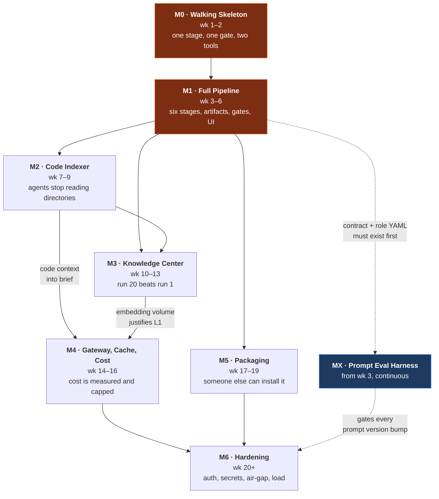

# ASDLC — Master Milestone Plan

> The single top-level plan. Each major milestone (M0–M6, plus the cross-cutting MX track)
> has its own file with sub-milestones (`M1.1`, `M1.2`, …). Read this first, then the file
> for the milestone you are actually building.

| | |
|---|---|
| **Source of truth** | [`docs/`](../docs) — 14 design documents. Milestones implement them; they do not replace them. |
| **Design decisions** | [D1–D6](../docs/00-overview.md#key-decisions). A milestone may not silently contradict one. |
| **Roadmap origin** | [`docs/12-roadmap.md`](../docs/12-roadmap.md) phases 0–6 map 1:1 onto M0–M6. |
| **Open questions** | [`docs/13-open-questions.md`](../docs/13-open-questions.md). Q1–Q4 must be answered before M1 starts. |

---

## The sequencing principle

> Build the thinnest thing that proves the stage-brief loop works end to end, *then* make each
> component good.

Milestones are ordered by **risk retirement**, not by architectural layering. The largest risk in
this project is not any single component — it is discovering in month three that agents in Cursor
ignore the server-served brief. M0 exists to find that out in week two, for the price of two weeks
rather than three months.

Every milestone ends in something usable. None ends in a half-built layer.

---

## Milestone map



**Critical path:** `M0 → M1 → M2 → M3 → M4 → M6`.
**Parallelisable:** M5 may start any time after M1.1 (the pack format) is frozen. MX starts with M1.

---

## Milestone summary

| ID | Name | Weeks | Proves | Cut deliberately |
|---|---|---|---|---|
| [**M0**](M0-walking-skeleton.md) | Walking skeleton | 1–2 | Client-side agents fetch and obey a server-served brief, in ≥2 tools | Retrieval, versioning, provenance, UI, auth, blobs |
| [**M1**](M1-full-pipeline.md) | Full pipeline, thin components | 3–6 | Six stages produce a mergeable PR with six human gates | Knowledge, code index, caching, semantic anything |
| [**M2**](M2-code-indexer.md) | Code indexer | 7–9 | Retrieval beats grep; brief tokens go down | Knowledge center, LSP enrichment, >5 languages |
| [**M3**](M3-knowledge-center.md) | Knowledge center | 10–13 | A run demonstrably reuses a prior run's decision | Jira/Confluence connectors, full-editor curation |
| [**M4**](M4-gateway-cache-cost.md) | Gateway, cache & cost | 14–16 | "Which stage costs the most?" is answerable from a dashboard | Headless/server-side agent execution |
| [**M5**](M5-packaging-distribution.md) | Packaging & distribution | 17–19 | A colleague reaches a completed run in <30 min from docs alone | Non-Claude/Cursor/Copilot tool targets |
| [**M6**](M6-hardening.md) | Hardening | 20+ | Survives a security review, a restore drill, and 10 concurrent runs | Kubernetes |
| [**MX**](MX-prompt-eval-harness.md) | Prompt eval harness | 3+ | Prompt changes are measured, not superstition | — |

Supporting reference: [**APPENDIX — Tech verification**](APPENDIX-tech-verification.md) — Context7-checked
library APIs, current versions, and the specific claims that still need hands-on verification.

---

## What each milestone adds to the running system

```
M0   ┌──────────────────────────────────────────────────────────┐
     │ gateway(5 tools) → core → postgres                        │
     │ artifacts as TEXT columns · CLI gate · hardcoded brief     │
     └──────────────────────────────────────────────────────────┘

M1   ┌──────────────────────────────────────────────────────────┐
     │ + artifact-svc → MinIO   + approvals-ui   + worker(git)    │
     │ + 6 roles from YAML  + prompt registry  + contract engine  │
     │ + gate policies/channels  + token auth  + full CLI         │
     └──────────────────────────────────────────────────────────┘

M2   ┌──────────────────────────────────────────────────────────┐
     │ + indexer-svc → Qdrant(code) + TEI                        │
     │ + tree-sitter · symbol graph · hybrid code search · L3     │
     └──────────────────────────────────────────────────────────┘

M3   ┌──────────────────────────────────────────────────────────┐
     │ + knowledge-svc → Qdrant(knowledge) + Postgres BM25        │
     │ + ingestion · curation UI · staleness worker · Context7     │
     └──────────────────────────────────────────────────────────┘

M4   ┌──────────────────────────────────────────────────────────┐
     │ + llm-gateway (LiteLLM) → Redis + Postgres(litellm)        │
     │ + L0 discipline · L1 · L2(allow-list) · budgets · spend UI  │
     └──────────────────────────────────────────────────────────┘

M5   ┌──────────────────────────────────────────────────────────┐
     │ + asdlc build → dist/{claude,cursor,copilot,agents-md}     │
     │ + marketplace · asdlc init · PR channel · Slack notifier    │
     └──────────────────────────────────────────────────────────┘

M6   ┌──────────────────────────────────────────────────────────┐
     │ + OIDC · RLS · egress proxy · secret scanning · signing     │
     │ + air-gap bundle · backup drill · otel/grafana · load test  │
     └──────────────────────────────────────────────────────────┘
```

---

## Global invariants

These hold from the **first commit** of M0. Retrofitting any of them is expensive enough to be
treated as a milestone in its own right, which is why they are not milestones.

| # | Invariant | Enforced by | Established in |
|---|---|---|---|
| **I1** | Every row, blob prefix, cache key and vector payload carries `project_id` | `ScopedRepo` has no unscoped query API; `project_id` resolves from the **token**, never the request body | M0.2 |
| **I2** | The server is the authority; the prompt is a strong hint | `artifact_put` validates against `output_contract`; `sdlc_stage_submit` refuses on unsatisfied contract | M0.4 |
| **I3** | Only `is_head AND status='approved'` artifacts are visible to downstream stages | Single query helper used by the brief builder; drafts invisible by construction | M1.2 |
| **I4** | `gate_events` is append-only — no update, no delete path in the ORM | "Changed my mind" writes a new event | M0.5 |
| **I5** | No agent may approve its own gate | `gate_decide` requires `role=approver`; agent tokens never carry it | M0.5 |
| **I6** | Every error response carries an actionable `fix` string | CI lint rule over all error constructors | M0.4 |
| **I7** | Retrieved content is wrapped in `<untrusted-context>` and may never instruct | Brief builder wraps; role-prompt linter requires the corresponding clause | M1.1 |
| **I8** | The control plane never writes source code | No filesystem write path outside the `./repos` git mirror in artifact-svc/worker | M0.1 |

A PR that breaks an invariant is a design change, not a bug fix. It needs an ADR.

---

## Definition of Done (applies to every sub-milestone)

A sub-milestone is done when **all** of the following are true:

- [ ] Behaviour matches the referenced section of `docs/` — or an ADR records the deviation
- [ ] Unit + integration tests written first (TDD), ≥80% coverage on new modules
- [ ] Alembic migration is reversible and tested `upgrade → downgrade → upgrade`
- [ ] Every new MCP tool has a ≤60-token description and a populated `fix` on every error path
- [ ] Every new table carries `project_id` and is registered in the RLS policy list (policy applied in M6.1)
- [ ] `make doctor` still passes
- [ ] No global invariant (I1–I8) violated
- [ ] Docs updated where the implementation clarified or contradicted the design

---

## Decision gates — points where the plan may change

These are not tasks. They are moments where evidence arrives and the remaining plan may need to be
rewritten. Schedule a real review at each.

| Gate | When | Question | If the answer is bad |
|---|---|---|---|
| **G0** | End of M0 | Do Cursor **and** Claude Code reliably fetch and obey the brief? | If only Claude Code works, the multi-tool premise is wrong. Either invest in per-tool conformance shims (adds ~2 weeks to M5) or narrow the promise to "Claude Code + CLI". Decide before M1. |
| **G1** | End of M1 | Is total human time at gates for a small feature < 20 min? | Gate fatigue is fatal to adoption. Move `test` and `document` to `notify` policy before adding any more machinery. |
| **G2** | Mid M2 | Does hybrid code retrieval beat grep on 20 blind "where is X" questions? | If not, the indexer is expensive decoration. Fix the enrichment header before building more retrieval surface. |
| **G3** | End of M3 | Does knowledge retrieval measurably improve artifacts (10 features, on/off, blind-rated)? | If no measurable difference, the knowledge center is an expensive filing cabinet. Freeze it at auto-ingest of ADRs only and skip the curation investment. |
| **G4** | Mid M4 | Is the L2 semantic-cache false-positive rate < 2% over 50 sampled hits? | **Turn L2 off.** It is the only tier that can cost correctness rather than money. |
| **G5** | End of M5 | Does a colleague reach a completed run in <30 min using only the docs? | The docs are the product at this point. Fix them before announcing anything. |

---

## Prerequisite decisions (block M1, not M0)

From [`docs/13-open-questions.md`](../docs/13-open-questions.md). M0 can be built without answering
these; M1 cannot, because they change the run state machine and the gate schema.

| Q | Question | Assumed answer | Cost if changed after M1 |
|---|---|---|---|
| **Q1** | One `develop` gate, or a gate per task node? | One gate, with `gate_per_task: true` available in project policy | `gates.stage` → `gates.scope` + UI queue rework |
| **Q2** | Where does code live during `develop`? | Model A — agent edits the working tree, ASDLC records the diff | Model B needs branch orchestration in worker + IDE UX work |
| **Q3** | One control plane per team, or per developer? | Shared-capable (project scoping everywhere), run solo on localhost initially | Per-developer forces a knowledge-sync design that does not exist |
| **Q4** | Does `review` duplicate existing PR review? | Option (c) — review findings post as comments on the existing PR | Needs a git-host integration; pulls work forward from M5.6 |

Q5–Q11 are cheaper and are answered at the milestone that needs them (noted in place).

---

## Effort model

Weeks assume **one focused engineer**. Two engineers do not halve them — M0 and M1 are largely
serial because the contract has to stabilise before anything else can be built against it. From M2
onward, the indexer / knowledge / packaging tracks parallelise cleanly.

```
wk  1  2  3  4  5  6  7  8  9 10 11 12 13 14 15 16 17 18 19 20 21 22
    ├M0──┤
          ├M1───────────┤
                         ├M2──────┤
                                   ├M3──────────┤
                                                 ├M4──────┤
          ·  ·  ·  ·  ·  ·  ·  ·  ·  ·  ·  ·  ·  ├M5──────┤
          ├MX ─────────────────── continuous ──────────────────────▶
                                                           ├M6 ────▶
    ▲             ▲              ▲          ▲        ▲        ▲
    G0            G1             G2         G3       G4       G5
```

---

## Where this most likely goes wrong

Each has a cheap early check, and each is assigned to a milestone that tests it.

| Risk | Early check | Owned by |
|---|---|---|
| Agents ignore the brief | Two-tool conformance suite before anything else is built | M0.6 / G0 |
| Gate fatigue — six gates is a lot | Measure human time at gates from the first real feature | M1.5 / G1 |
| Knowledge center becomes noise | precision@5 ≥ 0.7 as an exit criterion; staleness worker from day one | M3.8 / G3 |
| Semantic cache serves a wrong answer that looks right | Restricted allow-list, 0.95 threshold, sampled FP review | M4.4 / G4 |
| The compile-to-four-tools step rots | Golden-file tests; CI fails if the generated bootstrap drifts from the pack | M5.2 |
| Stack running cost exceeds token savings | Track it — and be honest that the value here is workflow and traceability, not primarily cost | M4.6 |
| tree-sitter heuristic refs mislead agents | Every ref carries `resolution: "heuristic"` and a confidence; never presented as ground truth | M2.5 |
| Retrofitting tenancy | `project_id` from the first migration (I1) | M0.2 |
